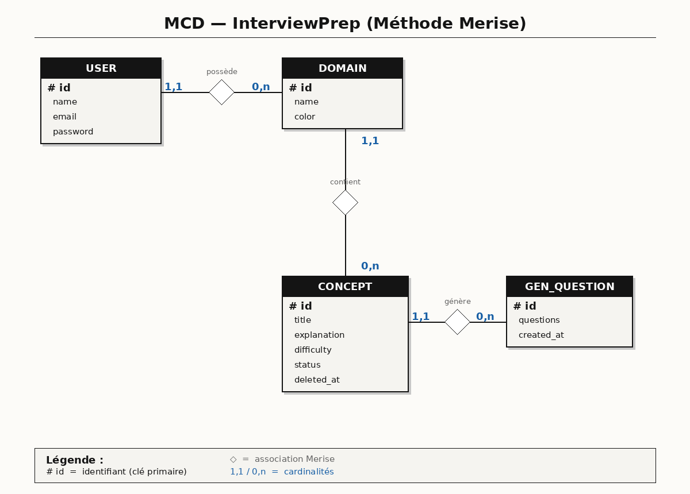
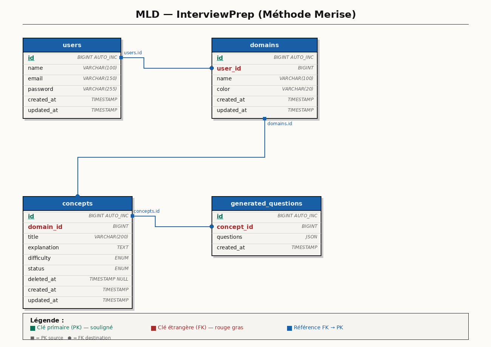

# 📚 InterviewPrep — AI-Assisted Laravel Application

> A personal knowledge management system to organize technical concepts and prepare for job interviews with AI-generated practice questions.

## 📖 Context & Problem

**InterviewPrep** is a Laravel web application built to solve a real-world problem: a Moroccan web developer just finished his training and has a technical interview at a SaaS startup in Casablanca (backend Laravel position) in **ten days**. He knows a lot but in a scattered way. This app gives him structure to:

- **Organize** technical knowledge by domain (Laravel, OOP, MySQL, REST APIs, etc.)
- **Write** concept notes explaining each topic in plain language
- **Track** mastery status per concept (To Review / In Progress / Mastered)
- **Generate** realistic interview questions via AI (Groq API) for any concept

**One user = one private workspace.** All data is scoped to the authenticated user.

---

## 🛠️ Tech Stack

| Layer | Technology | Version | Notes |
|-------|-----------|---------|-------|
| **Framework** | Laravel | 13.7+ | PHP 8.3+ |
| **Database** | MySQL | 8.0 | Eloquent ORM only |
| **Frontend** | Blade Templates | - | No Vue/React/Livewire |
| **CSS** | Tailwind CSS | 3.x | No Bootstrap |
| **HTTP Client** | Laravel `Http::` facade | - | Zero external packages for API calls |
| **AI API** | Groq API | `llama3-8b-8192` | OpenAI-compatible endpoint |
| **Auth** | Laravel Breeze | 2.4+ | Blade scaffolding |
| **Debug** | Laravel Debugbar | 4.2+ | Dev only — N+1 detection |
| **Version Control** | Git + GitHub | - | Feature branch workflow |

---

## 🤖 AI-Assisted Development

This project was built using **GitHub Copilot** (Claude Sonnet 4.5) as a coding agent to accelerate development while maintaining full transparency and control.

### Workflow

1. **PLAN Mode** — Agent proposes architecture and file structure
2. **Review** — Developer validates or adjusts the plan
3. **BUILD Mode** — Agent generates code following strict rules in `AGENTS.md`
4. **Manual Review** — Developer verifies, tests, and refines generated code

### Documentation Trail

All AI-assisted work is documented in:
- **`AGENTS.md`** — Complete ruleset for the coding agent (architecture, security, constraints)
- **`specs/`** folder — Feature specifications with "what was generated" vs "what was modified manually"

### Commit Convention

All commits include `[AI-assisted]` or `[manual]` prefixes to clearly indicate authorship:

```bash
[AI-assisted] feat: implement Domain CRUD with color badge
[manual] fix: resolve N+1 on domains index with withCount
```

---

## 📊 Database Design

### MCD (Conceptual Data Model)



**Entities & Relationships:**
- **User** `1—*` **Domain** — A user owns multiple technical domains
- **Domain** `1—*` **Concept** — A domain contains multiple concepts
- **Concept** `1—*` **GeneratedQuestion** — A concept can have multiple AI-generated question sets

### MLD (Logical Data Model)



**Tables:**

```sql
users
  id              BIGINT UNSIGNED PK AUTO_INCREMENT
  name            VARCHAR(255) NOT NULL
  email           VARCHAR(255) UNIQUE NOT NULL
  password        VARCHAR(255) NOT NULL
  remember_token  VARCHAR(100) NULL
  timestamps

domains
  id              BIGINT UNSIGNED PK AUTO_INCREMENT
  user_id         BIGINT UNSIGNED NOT NULL FK → users.id (cascade delete)
  name            VARCHAR(255) NOT NULL
  color           VARCHAR(7) NOT NULL  -- hex color e.g. #3B82F6
  timestamps

concepts
  id              BIGINT UNSIGNED PK AUTO_INCREMENT
  domain_id       BIGINT UNSIGNED NOT NULL FK → domains.id (cascade delete)
  user_id         BIGINT UNSIGNED NOT NULL FK → users.id (cascade delete)
  title           VARCHAR(255) NOT NULL
  explanation     TEXT NOT NULL
  difficulty      ENUM('junior', 'mid', 'senior') NOT NULL DEFAULT 'junior'
  status          ENUM('to_review', 'in_progress', 'mastered') NOT NULL DEFAULT 'to_review'
  deleted_at      TIMESTAMP NULL  -- soft deletes
  timestamps

generated_questions
  id              BIGINT UNSIGNED PK AUTO_INCREMENT
  concept_id      BIGINT UNSIGNED NOT NULL FK → concepts.id (cascade delete)
  questions       JSON NOT NULL  -- array of 5 question strings
  timestamps
```

---

## 🚀 Installation Instructions

### Prerequisites

- PHP 8.3+
- Composer
- Node.js & npm
- Docker & Docker Compose (for MySQL)

### Step 1 — Clone the repository

```bash
git clone https://github.com/azul-007/interview-forge.git
cd interview-forge
```

### Step 2 — Install dependencies

```bash
composer install
npm install
```

### Step 3 — Configure environment

```bash
cp .env.example .env
```

Edit `.env` and configure:

```env
# Database (Docker MySQL)
DB_CONNECTION=mysql
DB_HOST=127.0.0.1
DB_PORT=3306
DB_DATABASE=interview_prep
DB_USERNAME=root
DB_PASSWORD=root

# Groq AI API (get your free key at https://console.groq.com)
GROQ_API_KEY=your_groq_api_key_here
```

### Step 4 — Start Docker services

```bash
docker compose up -d
```

This starts:
- **MySQL 8.0** on port 3306
- **phpMyAdmin** on port 8081 → [http://localhost:8081](http://localhost:8081)

### Step 5 — Generate app key and migrate database

```bash
php artisan key:generate
php artisan migrate:fresh --seed
```

The seeder creates:
- **Test user:** `test@example.com` / `password`
- **3 sample domains:** Laravel ORM, PHP OOP, MySQL
- **6 sample concepts** with different status levels

### Step 6 — Build assets and start dev server

```bash
# Terminal 1 — Asset compilation
npm run dev

# Terminal 2 — Laravel server
php artisan serve
```

→ **App:** [http://localhost:8000](http://localhost:8000)
→ **phpMyAdmin:** [http://localhost:8081](http://localhost:8081)

### Step 7 — Login with test credentials

**Email:** `test@example.com`
**Password:** `password`

---

## 🔑 Test Credentials

| Field | Value |
|-------|-------|
| Email | `test@example.com` |
| Password | `password` |

---

## 🗺️ Routes

### Authentication (Breeze)

| Method | URI | Name | Description |
|--------|-----|------|-------------|
| GET | `/login` | `login` | Login form |
| POST | `/login` | - | Authenticate user |
| POST | `/logout` | `logout` | Logout user |
| GET | `/register` | `register` | Registration form |
| POST | `/register` | - | Create new user |

### Dashboard

| Method | URI | Name | Description |
|--------|-----|------|-------------|
| GET | `/` | `home` | Dashboard with progression stats |
| GET | `/dashboard` | `dashboard` | Dashboard (same as home) |

### Domains

| Method | URI | Name | Description |
|--------|-----|------|-------------|
| GET | `/domains` | `domains.index` | List all domains with concept counters |
| GET | `/domains/create` | `domains.create` | Create domain form |
| POST | `/domains` | `domains.store` | Store new domain |
| GET | `/domains/{domain}/edit` | `domains.edit` | Edit domain form |
| PATCH | `/domains/{domain}` | `domains.update` | Update domain |
| DELETE | `/domains/{domain}` | `domains.destroy` | Delete domain (cascades to concepts) |

### Concepts

| Method | URI | Name | Description |
|--------|-----|------|-------------|
| GET | `/domains/{domain}/concepts` | `domains.concepts.index` | List concepts for a domain (filterable by status/difficulty) |
| GET | `/domains/{domain}/concepts/create` | `domains.concepts.create` | Create concept form |
| POST | `/domains/{domain}/concepts` | `domains.concepts.store` | Store new concept |
| GET | `/domains/{domain}/concepts/{concept}` | `domains.concepts.show` | View concept detail + generated questions |
| GET | `/domains/{domain}/concepts/{concept}/edit` | `domains.concepts.edit` | Edit concept form |
| PATCH | `/domains/{domain}/concepts/{concept}` | `domains.concepts.update` | Update concept |
| DELETE | `/domains/{domain}/concepts/{concept}` | `domains.concepts.destroy` | Soft delete concept |
| PATCH | `/concepts/{concept}/status` | `concepts.updateStatus` | Quick status update from list |
| GET | `/concepts/archived` | `concepts.archived` | List soft-deleted concepts |
| PATCH | `/concepts/{concept}/restore` | `concepts.restore` | Restore archived concept |

### AI Generation

| Method | URI | Name | Description |
|--------|-----|------|-------------|
| POST | `/concepts/{concept}/generate` | `questions.generate` | Generate 5 interview questions via Groq API |
| DELETE | `/generated-questions/{generatedQuestion}` | `questions.destroy` | Delete a generated question set |

---

## 🧠 Key Concepts & Features

### 1. Eloquent Accessors (Laravel 9+ syntax)

Never expose raw enum values in views. Use **Eloquent Accessors** for clean, translatable labels:

**Model:** `app/Models/Concept.php`
```php
use Illuminate\Database\Eloquent\Casts\Attribute;

protected function statusLabel(): Attribute
{
    return Attribute::make(
        get: fn () => match($this->status) {
            'to_review'   => 'À revoir',
            'in_progress' => 'En cours',
            'mastered'    => 'Maîtrisé',
        }
    );
}

protected function difficultyLabel(): Attribute
{
    return Attribute::make(
        get: fn () => match($this->difficulty) {
            'junior' => 'Junior',
            'mid'    => 'Mid',
            'senior' => 'Senior',
        }
    );
}
```

**Usage in Blade:**
```blade
{{ $concept->statusLabel }}       {{-- ✅ Correct --}}
{{ $concept->difficultyLabel }}   {{-- ✅ Correct --}}
{{ $concept->status }}            {{-- ❌ Forbidden — raw enum value --}}
```

**Usage in AI Prompt:**
```php
$prompt = "Generate questions for a {$concept->difficultyLabel} level developer...";
```

### 2. Soft Deletes

Concepts are **soft-deleted** instead of permanently removed:

**Migration:**
```php
$table->softDeletes(); // Adds deleted_at column
```

**Model:**
```php
use Illuminate\Database\Eloquent\SoftDeletes;

class Concept extends Model
{
    use SoftDeletes;
}
```

**Usage:**
```php
$concept->delete();              // Soft delete (sets deleted_at timestamp)
$concept->restore();             // Restore archived concept
Concept::withTrashed()->get();   // Include soft-deleted records
Concept::onlyTrashed()->get();   // Only soft-deleted records
```

### 3. Zero N+1 Queries

All list pages use eager loading and aggregates to avoid N+1 problems:

**Example: Domains Index**
```php
$domains = auth()->user()
    ->domains()
    ->withCount([
        'concepts',
        'concepts as mastered_count' => fn($q) => $q->where('status', 'mastered'),
    ])
    ->get();
```

**Verified with:** Laravel Debugbar → SQL tab (1 base query + 1 aggregate query max)

### 4. Groq AI Integration (Zero External Packages)

Interview questions are generated using **Groq API** via Laravel's built-in `Http::` facade:

**Service:** `app/Services/GroqService.php`
```php
use Illuminate\Support\Facades\Http;

public function generateInterviewQuestions(Concept $concept): ?GeneratedQuestion
{
    $response = Http::withHeaders([
        'Authorization' => 'Bearer ' . config('services.groq.key'),
        'Content-Type'  => 'application/json',
    ])->timeout(15)->post('https://api.groq.com/openai/v1/chat/completions', [
        'model'      => 'llama3-8b-8192',
        'max_tokens' => 800,
        'messages'   => [
            [
                'role'    => 'system',
                'content' => 'You are a senior technical interviewer...',
            ],
            [
                'role'    => 'user',
                'content' => $this->buildPrompt($concept),
            ],
        ],
    ]);

    // Error handling, JSON parsing, validation, and database save
    // See GroqService.php for full implementation
}
```

**Controller:**
```php
public function store(Concept $concept, GroqService $groqService)
{
    $generation = $groqService->generateInterviewQuestions($concept);

    if (!$generation) {
        return back()->with('error', 'La génération a échoué...');
    }

    return back()->with('success', '5 questions générées avec succès.');
}
```

### 5. Form Request Validation

All create/update actions use **dedicated Form Request classes** (never inline validation):

**Files:**
- `StoreDomainRequest` / `UpdateDomainRequest`
- `StoreConceptRequest` / `UpdateConceptRequest`

**Example:** `app/Http/Requests/StoreConceptRequest.php`
```php
public function rules(): array
{
    return [
        'title'       => ['required', 'string', 'max:255'],
        'explanation' => ['required', 'string', 'min:20'],
        'difficulty'  => ['required', 'in:junior,mid,senior'],
        'status'      => ['sometimes', 'in:to_review,in_progress,mastered'],
    ];
}

public function authorize(): bool
{
    return auth()->check();
}
```

### 6. Policy-Based Authorization

All user-owned resources are protected via **Laravel Policies**:

**Policies:**
- `DomainPolicy` — Verify domain belongs to authenticated user
- `ConceptPolicy` — Verify concept's domain belongs to authenticated user
- `GeneratedQuestionPolicy` — Verify question's concept belongs to authenticated user

**Usage in Controllers:**
```php
public function update(UpdateDomainRequest $request, Domain $domain)
{
    $this->authorize('update', $domain);
    $domain->update($request->validated());
    return redirect()->route('domains.index')->with('success', 'Domaine mis à jour.');
}
```

---

## 🎯 Core Features

### 1. Dashboard — Progression Overview
- Global stats: total concepts by status (To Review / In Progress / Mastered)
- Best mastered domain (green badge)
- Domain needing most work (red badge)

### 2. Domain Management
- CRUD operations with color badges
- Concept counters (total + mastered)
- Cascade delete (deletes all concepts when domain is deleted)

### 3. Concept Management
- CRUD operations within domains
- Status tracking: To Review → In Progress → Mastered
- Difficulty levels: Junior / Mid / Senior
- Quick status update from list (no full form needed)
- Soft deletes with archive/restore functionality
- Combined filters (status + difficulty)

### 4. AI-Generated Interview Questions
- Generate 5 realistic questions via Groq API (`llama3-8b-8192`)
- Context-aware prompts using concept title, explanation, and difficulty level
- Saved in database with timestamp
- History view (latest first) with delete option
- Graceful error handling (no blank pages on API failure)

---

## 📁 Project Structure

```
app/
├── Http/
│   ├── Controllers/
│   │   ├── DashboardController.php
│   │   ├── DomainController.php
│   │   ├── ConceptController.php
│   │   └── GeneratedQuestionController.php
│   ├── Requests/
│   │   ├── StoreDomainRequest.php
│   │   ├── UpdateDomainRequest.php
│   │   ├── StoreConceptRequest.php
│   │   └── UpdateConceptRequest.php
│   └── Policies/
│       ├── DomainPolicy.php
│       ├── ConceptPolicy.php
│       └── GeneratedQuestionPolicy.php
├── Models/
│   ├── User.php
│   ├── Domain.php
│   ├── Concept.php
│   └── GeneratedQuestion.php
└── Services/
    └── GroqService.php

resources/views/
├── layouts/
│   └── app.blade.php
├── dashboard.blade.php
├── domains/
│   ├── index.blade.php
│   ├── create.blade.php
│   └── edit.blade.php
└── concepts/
    ├── index.blade.php
    ├── create.blade.php
    ├── edit.blade.php
    ├── show.blade.php
    └── archived.blade.php

specs/
├── 00-setup.md
├── 01-auth.md
├── 02-domains-crud.md
├── 03-concepts-crud.md
├── 04-ai-generation.md
└── 05-dashboard-bonus.md

docs/
├── MCD_InterviewPrep.png
└── MLD_InterviewPrep.png
```

---

## 🔒 Security Features

- All routes protected by `auth` middleware
- User-owned data scoped via Policies
- Form Request validation on all input
- CSRF protection on all forms (`@csrf`)
- Groq API key stored in `.env` only (never committed)
- No raw SQL queries (Eloquent only)
- Explicit `$fillable` on all models

---

## 🧪 Testing the App

### Manual Test Scenarios

1. **Access without login** → Redirects to `/login` ✅
2. **Register new user** → Creates account and redirects to dashboard ✅
3. **Create domain with color** → Badge appears with chosen color ✅
4. **Create concept** → Default status "To Review" ✅
5. **Quick status change** → Update from list without opening full form ✅
6. **Generate questions** → 5 questions saved and displayed ✅
7. **Invalid Groq key** → Error message shown (no blank page) ✅
8. **Delete domain** → Cascades to concepts and questions ✅
9. **Archive concept** → Soft delete (restorable from `/concepts/archived`) ✅
10. **Filter by status + difficulty** → Combined filters work ✅

### Debugbar Checks

- Open **Debugbar → SQL tab** on all list pages
- Verify **no N+1 queries** (stable query count regardless of data volume)

---

## 📜 License

This project is open-source software licensed under the MIT license.

---

## 👨‍💻 Author

Built by **Azul** as part of a 5-day Laravel sprint to demonstrate AI-assisted development practices.

**Contact:** [GitHub Profile](https://github.com/azul-007)

---

## 🙏 Acknowledgments

- **Laravel** — Elegant PHP framework
- **Groq** — Fast AI inference API
- **GitHub Copilot** — AI coding assistant
- **Laravel Debugbar** — Essential N+1 detection tool

## Security Vulnerabilities

If you discover a security vulnerability within Laravel, please send an e-mail to Taylor Otwell via [taylor@laravel.com](mailto:taylor@laravel.com). All security vulnerabilities will be promptly addressed.

## License

The Laravel framework is open-sourced software licensed under the [MIT license](https://opensource.org/licenses/MIT).
